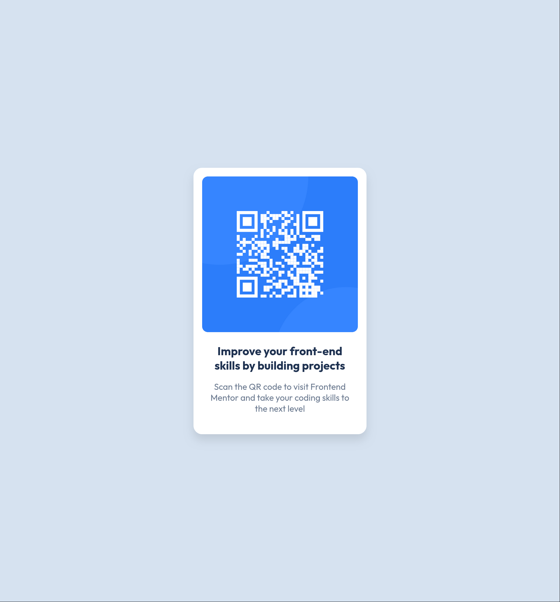

# Frontend Mentor - QR code component solution

This is a solution to the [QR code component challenge on Frontend Mentor](https://www.frontendmentor.io/challenges/qr-code-component-iux_sIO_H). Frontend Mentor challenges help you improve your coding skills by building realistic projects.

## Table of contents

- [Overview](#overview)
  - [Screenshot](#screenshot)
  - [Links](#links)
- [My process](#my-process)
  - [Built with](#built-with)
  - [What I learned](#what-i-learned)
- [Author](#author)

## Overview

### Screenshot




### Links

- Solution URL: (https://github.com/bobson/QR-code/)
- Live Site URL: (https://bobson.github.io/QR-code/)

## My process

### Built with

- Semantic HTML5 markup
- CSS custom properties
- Flexbox
- Mobile-first workflow

### What I learned

I am learning semantic HTML and CSS variables

```html
<article class="card">
  <figure class="card__image--container">
    
  </figure>
</article>
```

```css
.proud-of-this-css {
  :root {
    --white: hsl(0, 0%, 100%);
    --slate-300: hsl(212, 45%, 89%);
    --slate-500: hsl(216, 15%, 48%);
    --slate-900: hsl(218, 44%, 22%);

    --font-primary: Outfit, sans-serif;

    /* font weight */
    --fw-400: 400;
    --fw-700: 700;
  }
}
```

## Author

- Website - [Slobodan Markoski](https://slobodan.netlify.app/)
- Frontend Mentor - [@bobson](https://www.frontendmentor.io/profile/bobson)
